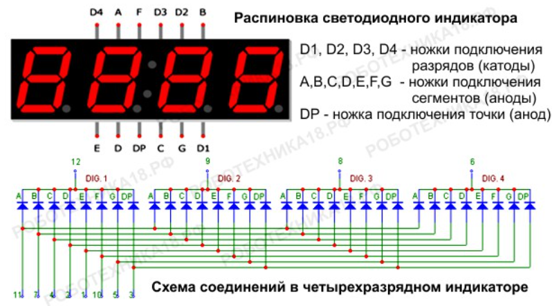

# Лабораторная работа №02: Работа с GPIO

## Описание лабораторной работы

В этой работе вы поближе познакомитесь с модулем GPIO:
- Подключение кнопки и работа с ней;
- Подключение семисегментного индикатора и работа с ним.

Предполагается, что вы ознакомились с первой лабораторной работой и умеете искать в документацию нужную информацию.

## Подключение компонентов
В данной лабораторной работе вы будете работать на макетной плате. Вам понадобится кнопка и 4-канальный семисегментный индикатор

Подключите кнопку к пину PA0 с одной стороны и к питанию с другой. При нажатии на кнопку на пине PA0 должна быть логическая единица.

Подключите семисегментный индикатор следующим образом: TODO


Соберите код с помощью make и загрузите код в микроконтроллер с помощью make flash. Понимажимайте на кнопку, убедитесь, что отсчет на индикаторе останавливается во время нажатия.


## Работа с кнопкой
В прошлой лабораторной работе мы научились управлять выходными пинами микроконтроллера. Но чтобы сделать микроконтроллер, который умеет взаимодействовать с внешним миром, мы должны научиться считывать значение с пина.

> Чтобы понять что происходит дальше нужно обязательно посмотреть видео про [управление GPIO STM32](https://www.youtube.com/watch?v=ynBOKPnYlyY&list=PLhtMaaf_npBzsEQ94eGn5RnuE-VdGVObR&index=5).

На самом деле, считывать значение с ножки просто:
1. Настроим режим пина на вход;
2. Включим подтягивающий на землю резистор;
3. Прочитаем бит регистра, который хранит в себе значение на пине.

Именно это и происходит в функции board_gpio_init(). В функции мы конфигурируем пин PA0 в режим входа с подтягивающим к земле резистором, а PA1-PA12 конфигурируем в режим выхода. Самостоятельно сверьте регистры с описаниями в даташите и замените все константы в коде на define-ы.

Чтобы считать значение на входе PA0, нужно обратиться к даташиту:


Значит, нужно прочитать нулевой бит регистра GPIOA_IDR, это и происходит в строчке функции main:
```C
bool active = *GPIOA_IDR & (1U << 0U);
```

Далее идет неочевидный на первый взгляд код:
```C
if (active)
{
    if (saturation < 5U)
    {
        saturation += 1U;
    }
    else
    {
        button_was_pressed = 1U;
    }
}
else
{
    saturation = 0U;
}
```
Данный код позволяет избавиться от явления **дребезга контактов**. Давайте взглянем на осциллограмму пина, к которому подключена ножка:

При нажатии на кнопку пин не сразу переходит в постоянное высокое состояние, а испытывает скачки. Из-за этого мы не можем быть уверены, что при переходе с 0 на 1 кнопка была нажата, мы должны детектировать высокое состояние хотя бы в течение нескольких тактов, чтобы явление дребезга прошло. Когда дребезг прошел, мы выставляем переменную button_was_pressed в единицу.

## Работа с семисегментным индикатором
Выглядит он следующим образом:


Чтобы понять, как это работает, взглянем на внутреннее устройство индикатора:



Вы можете заметить, что индикатор имеет 28 светодиодные палочки и 4 светодиодных точек, но выходов у индикатора только 12. Каким образом 12 выходов управляют 32 светодиодами?

С помощью механизма динамической индикации, главный принцип которой заключается в использовании свойства инерционности глаза.

Подробное описание принципа динамической индикации можно почитать [тут](https://www.radiokot.ru/start/mcu_fpga/avr/15/). Если коротко, восемь входов управляют светодиодными палочками в индикаторе, и 4 входа отвечают за номер цифры, которая отображается на индикаторе. Если подтянуть к земле все 4 катода, то все цифры покажут одно и то же значение. Чтобы цифры показывали разные значения нужно подтягивать катоды к земле по очереди и выставлять нужные значения на анодах. Таким образом цифры будут появляться по очереди. Если переключения достаточно быстрые, то можно получить "статическую" картину, при этом в конкретный момент времени будет гореть только один индикатор, а не все.

Это и происходит в цикле функции main:
```C
SEG7_push_display_state_to_mc(&seg7);
```
Данная функция просто записывает значение переменной seg7->display в GPIOA_ODR. seg7->display имеет тип uint32_t, а регистр GPIOA_ODR как раз размером в 32 бита.

Интересно то, каким образом формируется seg7->display. А происходит это в:

```C
void SEG7_set_number_quarter(struct Seg7Display* seg7, unsigned tick)
{
    uint32_t divisors[4] = {1, 10, 100, 1000};

    unsigned quarter = tick % 4;
    unsigned divisor = divisors[quarter];

    seg7->display = DIGITS[(seg7->number / divisor) % 10] | POSITIONS[quarter];
}
```

В зависимости от остатка деление текущего тика на 4 мы выбираем катод, а саму цифру мы берём из переменной seg7->number. С помощью нехитрой конструкции ```(seg7->number / divisor) % 10``` выбирается нужный десяток, а ``` | POSITIONS[quarter]``` подтягивает к питанию все катоды, кроме одного. Итого, загорится только одна цифра с нужным значением десятков. Самостоятельно разберитесь в определении констант.

## Подготовка

## Задачи к лабораторной №02
- [ ] Отрефакторить код:
  - [ ] В любой момент времени должно быть понятно, в какой бит какого регистра осуществляется запись.
  - [ ] Реализовать дефайны для всех бит регистров (см. документацию на микроконтроллер).
  - [ ] Реализовать макросы для записи значений в регистры.
  - [ ] Исправить ошибки в Pin Mapping-е (см. документацию на 7-сегментный индикатор).
  - [ ] Выделить заголовочные файлы, где это осмысленно.
- [ ] Измерить свою скорость реакции до рефакторинга и после рефакторинга. Предоставить данные.
- [ ] Реализовать игру "*пальчики*":
  - [ ] Есть две кнопки. Если кнопка **№i** нажата, то палец игрока **№i** опущен.
  - [ ] Если в какой-то момент палец игрока **№i** опущен и палец игрока **№j** - опускается, то:
    - Игрок **№i** - повержен, *в смятении*.
    - Игрок **№j** - одержал верх, *торжествует*.
  - [ ] Каждому игроку соответсвует диод (синий PC8, зелёный PC9 или внешний):
    - Если игрок *в смятении*, то его диод мигает с низкой частотой.
    - Если игрок *торжествует*, то его диод мигает с высокой частотой.
  - [ ] На семисегментном индикаторе отображаются счета обоих игроков.
- [ ] **Реализовать схему обработки дребезга кнопки "с гистерезисом"**
